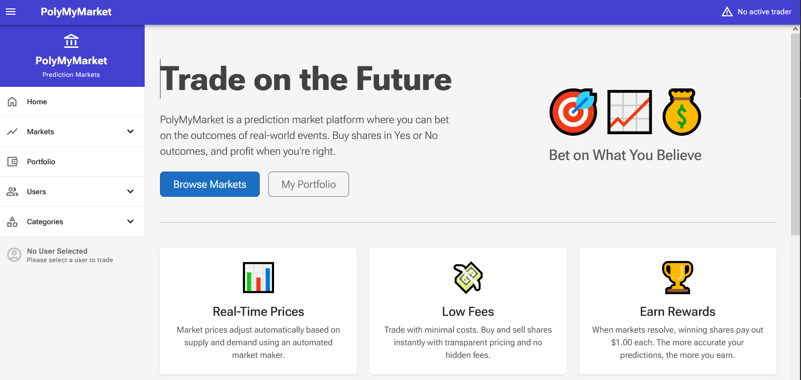
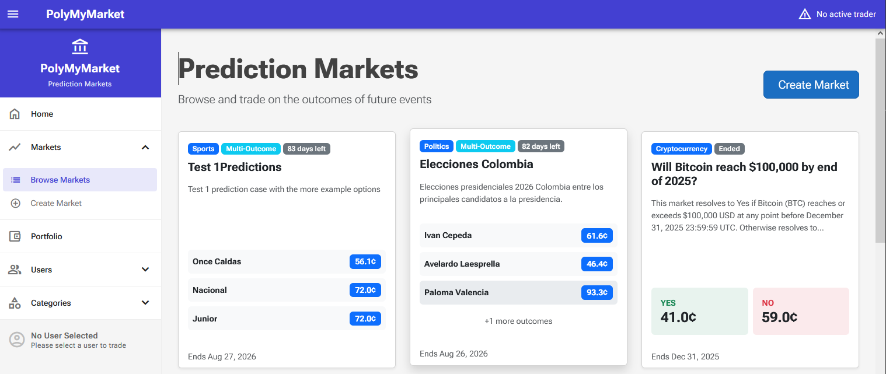
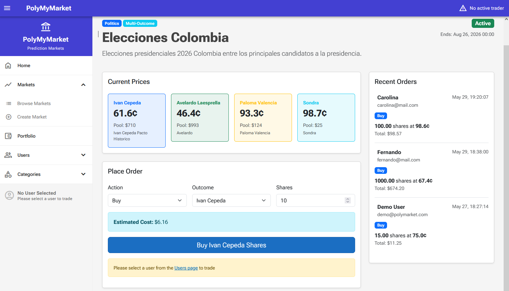
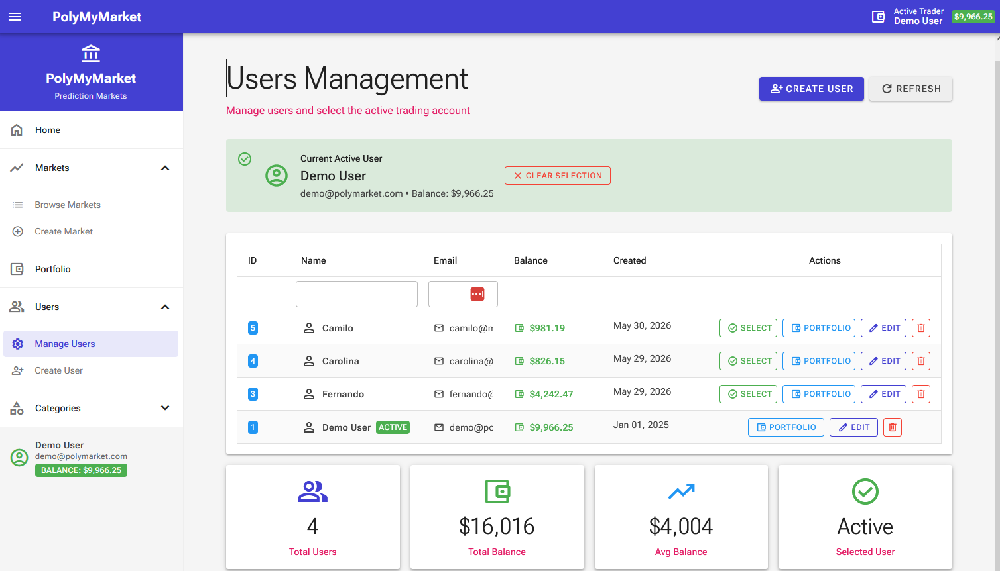
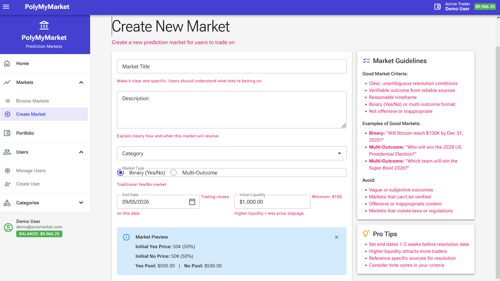

# PolyMyMarket

A modern prediction market platform built with Blazor Server (.NET 10) and Radzen UI components. PolyMyMarket allows users to create, trade, and manage prediction markets on various topics including Cryptocurrency, Technology, Politics, Sports, Economics, and Science.

## 🎯 Features

- **User Management**: Active trader selection and portfolio tracking
- **Market Types**: Both binary (Yes/No) and multi-outcome prediction markets
- **Category Filtering**: Browse markets by topic
- **Trading Interface**: Real-time buy/sell orders with dynamic pricing
- **Portfolio Management**: Track positions, P&L, and trading activity
- **Market Creation**: User-generated prediction markets
- **Modern UI**: Responsive interface built with Radzen Blazor Components

## 📸 Application Screenshots

### Home Page

*Main entry point of the application featuring the overview and quick access to key features*

### Markets Listing

*Browse view displaying available prediction markets with categories, prices, and market details. Supports filtering by category (Cryptocurrency, Technology, Politics, Sports, Economics, Science)*

### Market Detail & Trading

*Individual market view with detailed information including:*
- Market description and metadata
- Current prices (Yes/No for binary markets, multiple outcomes for multi-outcome markets)
- Trading interface
- User positions
- Recent order history with user information
- Order book/activity feed

### User Portfolio

*Personalized portfolio dashboard displaying:*
- User's available balance
- Current portfolio value
- Total invested amount
- Active positions across markets
- Recent order history
- Performance metrics and P&L

### Create Market

*Form interface for creating new prediction markets with:*
- Market title and description
- Category selection
- Market type (Binary or Multi-Outcome)
- End date configuration
- Initial liquidity settings
- Market validation

## 🏗️ Project Structure

```
PolyMyMarket/
├── PolyMyMarket.Web/          # Blazor Server web application
│   ├── Components/            # Razor components
│   │   ├── Layout/           # Layout components (MainLayout, NavMenu, etc.)
│   │   └── Pages/            # Page components
│   │       ├── Market/       # Market-related pages
│   │       └── UserOptions/  # User management pages
│   └── Services/             # Business logic services & CommandDispatcher
├── PolyMyMarket.Command/      # CQRS Command layer (write operations)
│   ├── Common/               # Command infrastructure (ICommand, ICommandHandler, CommandResult)
│   ├── Market/               # Market write commands and handlers
│   └── User/                 # User write commands and handlers
├── PolyMyMarket.Models/       # Domain models and entities
├── PolyMyMarket.Context/      # Entity Framework Core context and migrations
└── Resources/                 # Screenshots and visual assets
```

## 🛠️ Technical Stack

- **Framework**: .NET 10
- **UI**: Blazor Server with InteractiveAuto rendering
- **Component Library**: Radzen Blazor Components
- **Database**: Entity Framework Core with SQL Server
- **Architecture**: CQRS-lite pattern with command/query separation
  - **Commands**: Write operations isolated in `PolyMyMarket.Command` project
  - **Queries**: Read operations in service layer
  - **CommandDispatcher**: Centralized command execution via DI

## 🚀 Getting Started

### Prerequisites

- .NET 10 SDK
- SQL Server (LocalDB or full instance)
- Visual Studio 2026 or later (recommended) or VS Code

### Installation

1. Clone the repository:
   ```bash
   git clone https://github.com/mariobot/poly-my-market.git
   cd poly-my-market
   ```

2. Restore dependencies:
   ```bash
   dotnet restore
   ```

3. Update the database connection string in `PolyMyMarket.Web/appsettings.json`

4. Apply database migrations:
   ```bash
   cd PolyMyMarket.Context
   dotnet ef database update
   ```

5. Run the application:
   ```bash
   cd ../PolyMyMarket.Web
   dotnet run
   ```

6. Open your browser and navigate to `https://localhost:5001`

## 📦 Key Components
- **Home**: Landing page with quick access to features
- **Markets**: Browse and filter prediction markets
- **MarketDetail**: Trade on individual markets
- **Portfolio**: View user positions and performance
- **CreateMarket**: Create new prediction markets
- **UsersList**: Manage users and select active trader

## 🎨 UI Features

- **Reactive State Management**: Real-time updates when user selection changes
- **Category Filtering**: URL-based filtering (`/markets?category=Cryptocurrency`)
- **Radzen Components**: Professional UI with dialogs, notifications, and data grids
- **Responsive Design**: Works on desktop and mobile devices
- **Reconnection Modal**: Graceful handling of connection interruptions

## 📊 Database Schema

- **Markets**: Prediction market definitions
- **MarketOutcomes**: Outcomes for multi-outcome markets
- **Users**: User accounts and balances
- **Orders**: Trading history
- **Positions**: Binary market holdings (YesShares, NoShares)
- **OutcomePositions**: Multi-outcome market holdings

## 🤝 Contributing

Contributions are welcome! Please feel free to submit a Pull Request.

## 📄 License

This project is open source and available under the [MIT License](LICENSE).

## 📞 Contact

- **Repository**: [https://github.com/mariobot/poly-my-market](https://github.com/mariobot/poly-my-market)
- **Issues**: [GitHub Issues](https://github.com/mariobot/poly-my-market/issues)

---

*Built with ❤️ using Blazor, Radzen, and CQRS architecture*

*Last Updated: December 2024*
